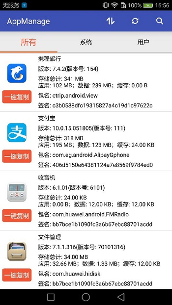
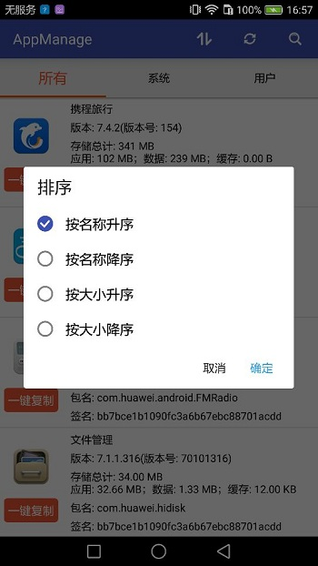
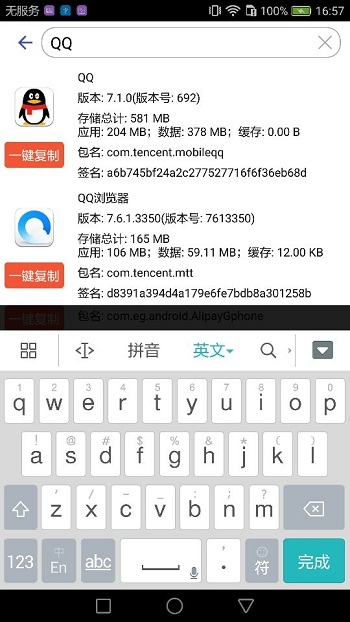

# AppManage-master —— APP信息查询工具
可以查询应用名称、版本、存储空间、包名、签名，支持分类、刷新、排序、搜索

## 下载 ##

[AppManage](./AppManage-v3.2.apk)

## 效果演示 ##
#### 设备上的所有应用程序分为所有、系统、用户三类： ####

#### 支持按名称升序、按名称降序、按大小升序、按大小降序四中排序方式： ####

#### 支持应用名称、包名模糊搜索： ####

